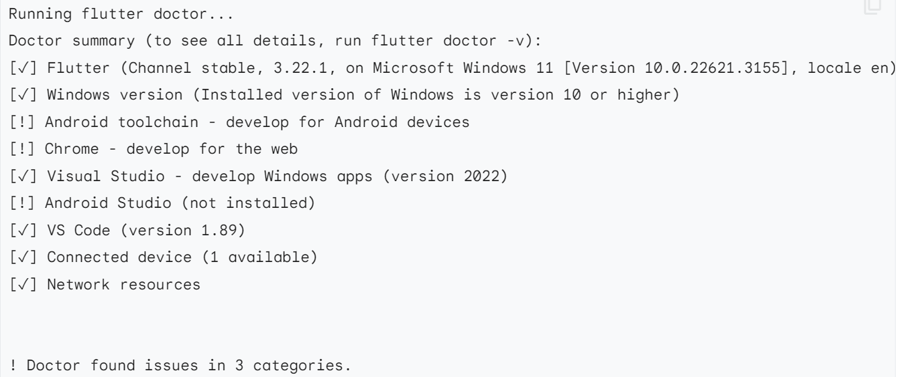
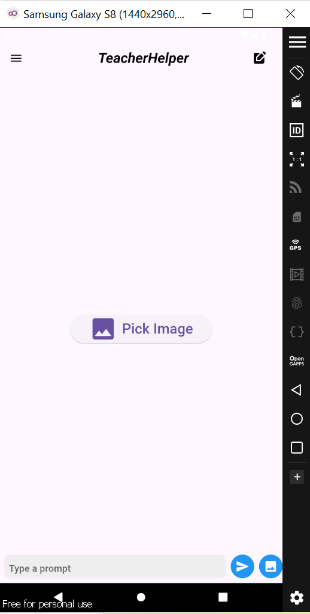
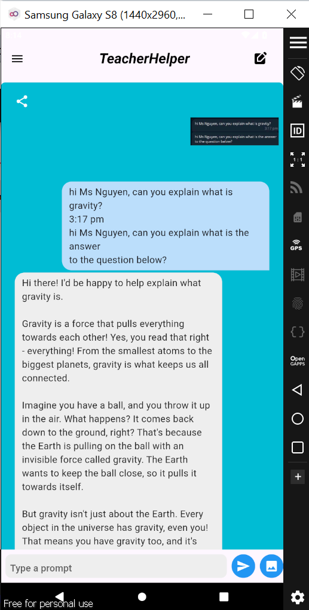

<a name="readme-top"></a>

<!-- PROJECT SHIELDS -->

[![Github-repo][Github-repo]][github-link]

<!-- PROJECT LOGO -->
<br />
<div align="center">

<h2 align="center">AI Teacher Chatbot</h2>

  <p align="center">
    Empowering Teachers, One Answer at a Time​ 
    <br />
    <a href="https://github.com/jiayenbeh/AI-Teacher-Chatbot"><strong>Github Repository »</strong></a>
  </p>
</div>

<!-- TABLE OF CONTENTS -->
<details>
  <summary>Table of Contents</summary>
  <ol>
    <li>
        <a href="#built-with">Built With</a>
    </li>
    <li>
      <a href="#project-background">Project Background</a>
    </li>
    <li>
      <a href="#folder-directory">Folder Directory</a>
    </li>
    <li>
      <a href="#getting-started">Getting Started</a>
      <ul>
        <li><a href="#prerequisites">Packages Needed</a></li>
      </ul>
    </li>
    <li><a href="#installation">Installation</a></li>
    <li><a href="#usage">Usage</a></li>
    
    
  </ol>
</details>

## Built With

[![Flutter][Flutter]][Flutter-url] 
[![Dart][Dart]][Dart-url]
[![Meta][Meta]][Meta-url]
[![Android Studio][Android Studio]][Android-url]

<!-- Project Background -->

## Project Background

The AI Teacher Chatbot is designed to streamline the process of answering questions for teachers, significantly reducing their after-hours workload and enhancing their productivity. With its intuitive interface and advanced functionalities, it enables educators to efficiently manage and respond to student inquiries, allowing them to focus more on teaching and less on administrative tasks.

<p align="right">(<a href="#readme-top">back to top</a>)</p>

<!-- Folder Directory -->

## Folder Directory

```
project/
├── android
├── ios
├── lib/
│   ├── main.dart
|   ├── locator.dart
│   ├── models/
│   │   └── message.dart
│   ├── services/
│   │   ├── llmservice.dart
│   │   ├── ocrservice.dart
│   │   ├── pickcrop_image.dart
│   │   └── share.dart
│   ├── constants/
│   |   └── route_names.dart
│   ├── ui/
|   |   ├── views/
|   |   |   └── chat_screen.dart
│   │   └── widgets/
|           └── navigation_drawer.dart
└── pubspec.yaml
```

<table border='1'>
    <tr>
        <th>File</th>
        <th>Description</th>
    </tr>
    <tr>
        <td>main.dart</td>
        <td>The starting code to run the Flutter project</td>
    </tr>
    <tr>
        <td>locator.dart</td>
        <td>Assist in routing of pages (i.e. Login page, Signup page, Splash page, Chat Screen page, Analytics Dashboard page)</td>
    </tr>
    <tr>
        <td>message.dart</td>
        <td>The message model</td>
    </tr>
    <tr>
        <td>llmservice.dart</td>
        <td>Integration of Groq using API to prompt the LLM of choice and generate the response.</td>
    </tr>
    <tr>
        <td>ocrservice.dart</td>
        <td>Tapping on the Google ML Kit to scan images and convert them to text. <br> DISCLAIMER: As of past testing in July 2024, the OCR does not scan handwriting well but screenshots work well.</td>
    </tr>
    <tr>
        <td>pickcrop_image.dart</td>
        <td>Tapping on image_picker and image_cropper package to edit the selected image before converting the image to text to prompt the LLM.</td>
    </tr>
    <tr>
        <td>share.dart</td>
        <td>Tapping on share_plus package to enable the sharing of individual prompt and response via messanging and email platforms.</td>
    </tr>
    <tr>
        <td>route_names.dart</td>
        <td>Storing of route names for dynamic routing in the future.</td>
    </tr>
    <tr>
        <td>chat_screen.dart</td>
        <td>The home page and main page where the main functionalities are carried out. The codes are separated into functionlities at the top and UI code at the bottom. Further changes to the code: <br><br>
        <ul>
            <li>Create function logic when the "new chat" button is clicked</li>
            <li>Disable "new chat" button when the chat screen is empty (i.e. in new chat state)</li>
            <li>Create a chat template to display the messages from the user and the bot when a saved chat is opened</li>
            <li>Create a "persona" button and add the function logic to adjust the prompt template according to the selected persona option</li>
            <li>Create a "TTS" button and add the function logic to verbalise the generated response </li>
        </ul>
        </td>
    </tr>
     <tr>
        <td>navigation_drawer.dart</td>
        <td>The UI and functionalities codes for the navigation side drawer which should contain all the saved chats, and when clicked, the hwole chat history will be displayed on the chat screen.</td>
    </tr>
</table>

<p align="right">(<a href="#readme-top">back to top</a>)</p>

<!-- GETTING STARTED -->

## Getting Started

### Prerequisites

These are the required softwares to test the mobile development of respective OS:


- Android Emulator (Either [Genymotion](https://www.genymotion.com/product-desktop/download/) or [Android Studio](https://developer.android.com/studio))
- iOS Emulator [Xcode](https://apps.apple.com/us/app/xcode/id497799835) (only works on Mac) 


## Installation

1. **Clone the repository**
    ```sh
    git clone https://github.com/jiayenbeh/AI-Teacher-Chatbot.git
    ```
   
     <br>
2. **Flutter Installation**
   <br>
    Step 1. Download the flutter SDk based on your OS [here](https://docs.flutter.dev/get-started/install?gad_source=1&gclid=CjwKCAjwzIK1BhAuEiwAHQmU3oCybdTXj-LNv5-iw9JhlXW_K-k_gev3bp4YW3thqLe3RPLhVjkcTxoCU4kQAvD_BwE&gclsrc=aw.ds):
    <br>

    Step 2. Open up a terminal or command prompt and enter the command To check if Flutter is set up properly.
    ```shell
    flutter doctor
    ```
    If your Flutter is set up properly, the result of your command should resemble this:
      

    Step 3. Navigate to the root director and install all the prerequisite dependencies in `pubspec.yaml`
    ```
    flutter pub get
    ```

<p align="right">(<a href="#readme-top">back to top</a>)</p>

## Usage

1. **Groq API Key**

    Create a Groq API key [here](https://console.groq.com/keys) and replace the placeholder in the `llmservice.dart` file before running the project. 
    
    <br>

2. **Android Emulator**

    Open up your emulator software and start up the phone model of your choice.
    
    <br>

1. **Flutter**

    Select the phone model to be the device to use and run the command on your terminal: 

    ```
    flutter run
    ```
    For the first time, it may take quite awhile to assemble gradle and subsequent time it will be faster. Once the project has start up, you are good to go!

    
    

<p align="right">(<a href="#readme-top">back to top</a>)</p>

<!-- MARKDOWN LINKS & IMAGES -->
<!-- https://www.markdownguide.org/basic-syntax/#reference-style-links -->

[github-repo]: https://img.shields.io/badge/GitHub-000000?style=for-the-badge&logo=Github&logoColor=white
[github-link]: https://github.com/jiayenbeh/AI-Teacher-Chatbot
[Flutter]: https://img.shields.io/badge/Flutter-02569B.svg?style=for-the-badge&logo=Flutter&logoColor=white
[Flutter-url]: https://flutter.dev/
[Dart]: https://img.shields.io/badge/Dart-0175C2?style=for-the-badge&logo=Dart&logoColor=white
[Dart-url]: https://dart.dev/
[Meta]: https://img.shields.io/badge/Meta-0467DF?style=for-the-badge&logo=Meta&logoColor=white
[Meta-url]: https://llama.meta.com/
[Android Studio]: https://img.shields.io/badge/Android%20Studio-%233DDC84?style=for-the-badge&logo=Android%20Studio&logoColor=white
[Android-url]: https://developer.android.com/studio